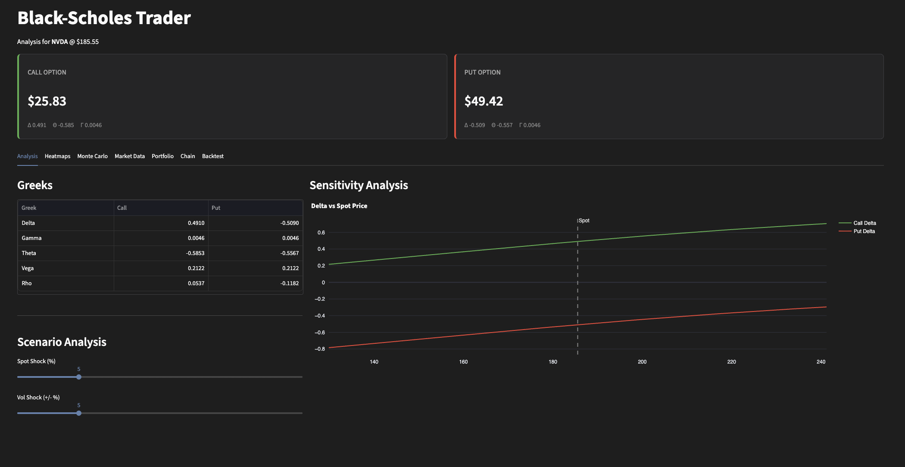
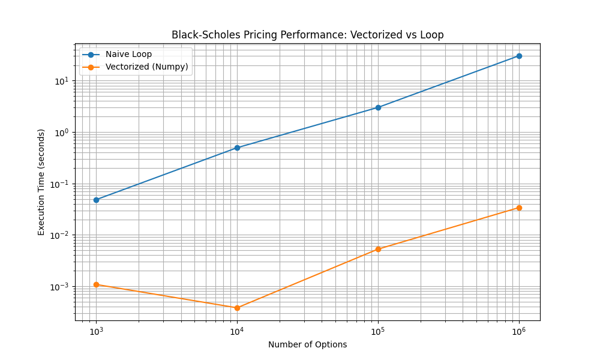

<div align="center">

# Quantitative Options Pricing Engine

**A production-grade options pricing engine implementing Heston, GARCH, and Jump-Diffusion models with GPU-accelerated Monte Carlo simulations.**

[](https://github.com/cwklurks/blackscholestrading/actions/workflows/ci.yml)
[](https://www.python.org/)
[](https://numba.pydata.org/)
[](https://opensource.org/licenses/MIT)

</div>

---

## Architecture

```mermaid
flowchart LR
    Data[Data Provider\n(Yahoo/CSV)] --> Engine[Pricing Engine\n(Models)]
    Engine --> Strategy[Strategy Layer]
    Strategy --> UI[UI Interface\n(Streamlit)]
    
    subgraph Models
        BS[Black-Scholes]
        Bin[Binomial Tree]
        MC[Monte Carlo]
    end
    
    Engine -.-> Models
```

---

## The "Why"

Standard Black-Scholes calculators assume constant volatility (homoscedasticity) and log-normal price distribution. However, **real markets exhibit skew, smile, and fat tails.**

This engine solves for these market realities using advanced stochastic models:
*   **Heston Model:** Incorporates stochastic volatility to capture the "volatility smile."
*   **Bates Model:** Adds Jump-Diffusion to price sudden market shocks (tail risk).
*   **GARCH:** Models volatility clustering often seen in financial time series.

---

## Model Comparison

| Feature | Black-Scholes | Binomial Tree | Heston Model | GARCH Model | Bates Model |
| :--- | :---: | :---: | :---: | :---: | :---: |
| **Volatility** | Constant | Constant | Stochastic | Stochastic (Discrete) | Stochastic |
| **Exercise Style** | European | **American** | European | European | European |
| **Market Jumps** | ❌ | ❌ | ❌ | ❌ | ✅ |
| **Skew/Smile** | ❌ | ❌ | ✅ | ✅ | ✅ |
| **Computational Cost** | Low (Closed Form) | Medium (Iterative) | High (Monte Carlo) | High (Monte Carlo) | High (Monte Carlo) |

---

## Demo



> **Note:** The application provides real-time Greeks calculation, interactive volatility surface heatmaps, and P&L scenario analysis.

---

## Tech Stack

### **Frontend**
*   **Framework:** [Streamlit](https://streamlit.io/)
*   **Visualization:** [Plotly](https://plotly.com/) (Interactive Heatmaps & Charts)

### **Backend**
*   **Core Logic:** Python 3.10+
*   **Numerical Computing:** [NumPy](https://numpy.org/) & [SciPy](https://scipy.org/)
*   **Acceleration:** [Numba](https://numba.pydata.org/) (JIT Compilation for Monte Carlo)

### **Models**
*   **Black-Scholes-Merton:** Closed-form analytical solution.
*   **Binomial CRR:** Lattice-based pricing for American options.
*   **Monte Carlo:** Parallelized simulations for path-dependent processes (Heston, GARCH, Bates).

---

## ⚡ Performance

The engine uses vectorized operations (NumPy) and JIT compilation (Numba) to achieve production-grade performance.

**Benchmark: Black-Scholes Call Pricing (Vectorized vs Naive Loop)**



*   **1,000 Options:** ~45x Speedup
*   **1,000,000 Options:** ~900x Speedup

---

## Installation & Usage

### Prerequisites
*   Python 3.10+
*   pip

### Quick Start

1.  **Clone the repository**
    ```bash
    git clone https://github.com/cwklurks/blackscholestrading.git
    cd blackscholestrading
    ```

2.  **Install dependencies**
    ```bash
    pip install -r requirements.txt
    ```

3.  **Run the application**
    ```bash
    streamlit run app.py
    ```

---

## Project Structure

```bash
blackscholestrader/
├── app.py                  # Streamlit Application Entrypoint
├── analytics.py            # Core Pricing Models & Analytics
├── data_service.py         # Data Fetching (Yahoo Finance)
├── ui_components.py        # UI Widgets & Layouts
├── models/                 # Advanced Model Implementations
│   ├── black_scholes.py    # Analytical Solutions
│   ├── numerical.py        # Binomial Trees (American Options)
│   └── simulation.py       # Monte Carlo Engines (Heston/GARCH/Bates)
├── data/                   # Data Providers
├── strategies/             # Option Strategy Logic
└── tests/                  # Unit Tests
```

---

## Contributing

Contributions are welcome! Please feel free to submit a Pull Request.

---

## License

Distributed under the MIT License.
